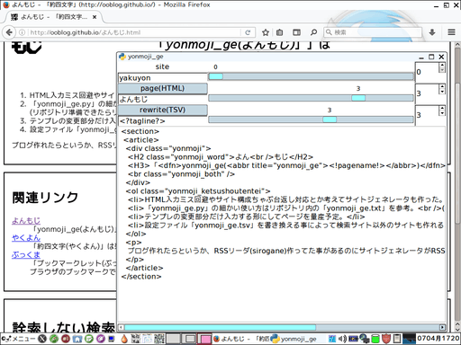

# 「yonmoji_ge」は「約四文字」サイトジェネレータのPythonによる実装です。

[https://ooblog.github.io/](https://ooblog.github.io/)のPagesを検索エンジン風に構築。  
ラノベ等で検索エンジンっぽい何かが必要になった時などの大道具小道具的な用途を想定。
  

「site」は作成するサイトのテンプレートや各リポジトリのサブディレクトリなどを選びます。  
「page&#40;HTML&#41;」は作成するHTMLページ名を入力します。空入力&#40;「.」のみなど無効なファイル名&#41;で日付&#40;yyyy-mm-dd&#41;の代入も可能です。  
「rewrite&#40;TSV&#41;」はテンプレ項目を選びます。置換内容はテキストエディタに入力します。  

一度作成したファイルはシーク操作等で開く事が可能。保存しないでシークすると入力データは消えるので注意。  
「yakuyon/&#42;.tsv」などの入力データファイルを消す操作は無いので逆に初期化したい時は「yakuyon/&#42;.tsv」を削除して、ファイルが無い状態で入力欄で&#91;enter&#93;キー。  

## 入力項目の変更やサイトのテンプレ追加もできます。

設定ファイル「[yonmoji_ge.tsv](yonmoji_ge.tsv)」などの解説は「[yonmoji_ge.txt](yonmoji_ge.txt)」を参考。  
初期設定では[「約四文字&#40;yakuyon&#41;」](https://ooblog.github.io/)を想定したサンプルを同梱してます。
設定ファイル「[yonmoji_ge.tsv](yonmoji_ge.tsv)」の編集方法など詳しい事は「[yonmoji_ge.txt](yonmoji_ge.txt)」の方に書いてます。  

## 「L:Tsv」は「yonmoji_ge」を動かすためのモジュール群です。

「L&#58;Tsv」モジュールの仕様は「[kanedit](https://github.com/ooblog/LTsv10kanedit)」の方の「[LTsv.txt](https://github.com/ooblog/LTsv10kanedit/blob/master/LTsv.txt)」の方に書いてます。  

## 動作環境。

Python 2.7.6&#40;Tahrpup6.0.5#41;およびPython3.4.4&#40;Wine1.7.18&#41;で動作を確認しています。  
Python2.7.3&#40;PuppyLinux571JP#41;およびPython3.4.3&#40;Wine1.7.18&#41;でも多分動くかと思います&#40;旧開発環境&#41;。  

## ライセンス・著作権など。

Copyright (c) 2016 ooblog  
License: MIT  
[https://github.com/ooblog/yonmoji_ge/blob/master/LICENSE](https://github.com/ooblog/yonmoji_ge/blob/master/LICENSE "https://github.com/ooblog/yonmoji_ge/blob/master/LICENSE")  
